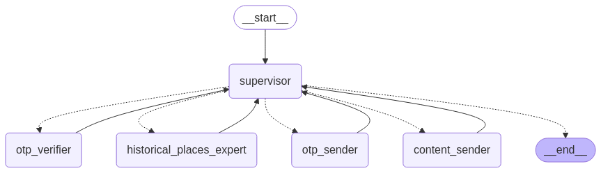

# Historical Agentic AI

Historical Agentic AI is a multi-agent conversational AI application built with LangChain and LangGraph. It specializes in answering queries related to historical monuments and integrates an OTP verification system to send curated historical place recommendations via email.

## Features

- Conversational AI for historical monuments
- Web search integration using DuckDuckGo
- OTP verification system for email confirmation
- Automated email delivery of historical recommendations
- Streamlit-based web interface
- Multi-agent system with workflow supervision

## Directory Structure

```
.
├── venv/                 # Virtual environment (ignored in .gitignore)
├── .env                  # Environment variables (ignored in .gitignore)
├── .gitignore            # Specifies ignored files
├── app.py                # Main application script (Streamlit UI)
├── app.ipynb             # Jupyter Notebook version of the app
├── output.png            # Visualization of the multi-agent workflow
├── requirements.txt      # Required dependencies
```

## Installation

### 1. Clone the repository

```bash
git clone <repository_url>
cd historical-agentic-ai
```

### 2. Create a virtual environment and activate it

```bash
python -m venv venv
source venv/bin/activate  # On macOS/Linux
venv\Scripts\activate     # On Windows
```

### 3. Install dependencies

```bash
pip install -r requirements.txt
```

### 4. Set up environment variables

Create a `.env` file and add the following credentials:

```
OPENAI_API_KEY=your_openai_api_key
SERPAPI_API_KEY=your_serpapi_key
SMTP_PASSWORD=your_smtp_password
EMAIL_ADDRESS=your_email_address
```

## Running the Streamlit Application

```bash
streamlit run app.py
```

## Usage

1. Start the app and interact with the chatbot.
2. Ask about historical monuments and receive suggestions.
3. Provide your email to receive a detailed list.
4. Verify your email using the OTP system.
5. Get an email with recommended historical places.

## Multi-Agent Workflow

The application consists of the following AI agents:

1. **Historical Places Expert**: Answers queries and fetches historical information.
2. **OTP Sender**: Sends OTP codes for email verification.
3. **OTP Verifier**: Validates user-entered OTPs.
4. **Content Sender**: Emails historical place recommendations to verified users.

The multi-agent workflow is supervised using LangGraph, ensuring a structured conversational flow. The `output.png` file visualizes the workflow structure.


## Dependencies

The project uses the following libraries:

- `langchain`, `langchain-core`, `langgraph`, `langgraph-supervisor`
- `langchain_groq`, `langchain_openai`
- `duckduckgo-search`, `langchain_community`
- `streamlit` for the web app
- `python-dotenv` for environment variable management

## License

This project is open-source and available under the MIT License.

## Contribution
[Vikas Chauhan](https://www.linkedin.com/in/vikas-chauhan-700a7b189/)

